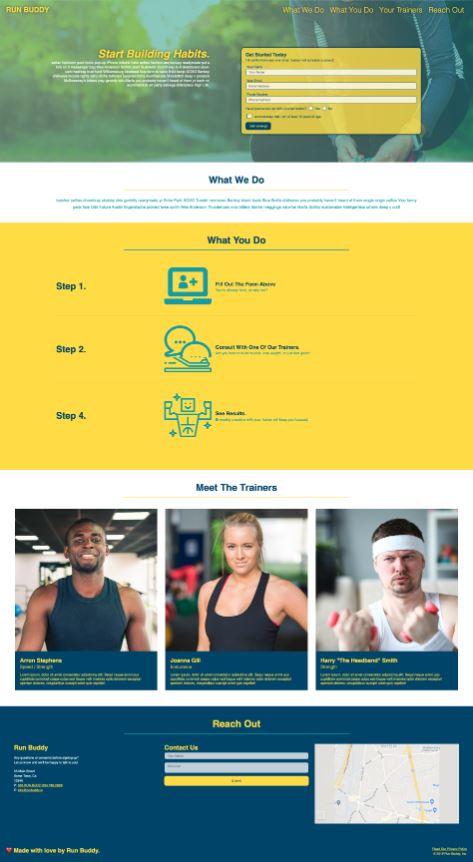

# Run Buddy

## Table-of-Contents

- [Description](#description)
- [Deployed Site](#deployed-site)
- [Features](#features)
- [Technologies](#technologies)
- [Future Development](#future-development)
- [Credits](#credits)

## Description

RunBuddy was built using a premade design mockup. In this project, I implement responsive HTML elements and CSS properties to make a functional and visually appealing webpage in which users can sign up for sessions with RunBuddy's personal trainers. This project features an assignment that mimics working closely with a client to address constantly updating needs and design choices.

## Deployed Site

Follow [this link](https://ashlynn4567.github.io/RunBuddy/) to view and use my site!

## Features

This is how Run Buddy currently appears to viewers. The page is responsive, adapting to multiple screen sizes. It is important to note that this project was built with only HTML and CSS, so the forms do not actually function.

Using flexbox and media queries, this page resizes appropriately to different screen sizes. It features a navigation bar, a hero section with a call-to-action form, an about section, an informational section about the trainers, and a contact form embeded in the footer.

## Technologies

- HTML
- CSS

## Future Development

In the future, I would like to add the following improvements:

- Add functionality and data storage features to the call-to-action form and contact form.

I'm always interested in refactoring code to improve it's functionality. If you would like to suggest your own improvements, you can reach me at the links below.

- <a href="mailto:ashlynn4567@gmail.com">Email</a>
- <a href="https://github.com/ashlynn4567">GitHub</a>
- <a href="https://www.linkedin.com/in/ashley-lynn-smith/">LinkedIn</a>

## Credits

This project was built with the help of the University of Oregon's Coding Boot Camp.

## Licensing

The application is covered under the following license: [MIT](https://opensource.org/licenses/MIT)
