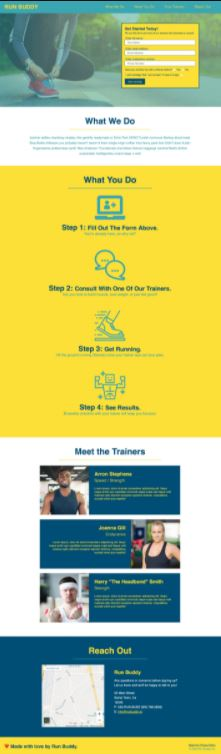
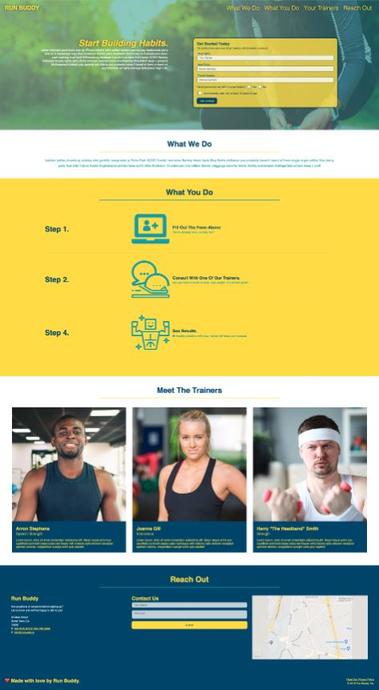

# Run Buddy Inc.

## Welcome to RunBuddy.

This project features an assignment that mimics working closely with a client to address constantly updating needs and design choices. 

Through making this website, I created my first full webpage using HTML and CSS. This page started off with a basic HTML skeleton using semantic elements. After building the base, I added CSS to style the webapge according to the mockup images I was given by the RunBuddy team. They wished to create a visually appealing landing page that featured a call to action form. This form allowed users to sign up for their personal trainer services, building their client base one click at a time. 

Because they relied on these sign ups, the form element changed several times. Originally, this website was outfitted with basic styling elements. However, RunBuddy found that their client base used a variety of devices, and then requested that we make the webpage responsive to accomodate many different types of users. Flexbox CSS funcitonality was added, including media queries that accounted for multiple device sizes. We also updated the visual appeal of their hero section by making the call to action form a transparent box to show some of the background image. This site also features a contact section with an embedded Google Map at the bottom. This implementation added to the usablity and professional feel of the site as a whole. 

This project gave me experience with refactoring code multiple times to meet with a client's changing needs. The added implementation really made the site easier to use, and resulted in a higher user base for RunBuddy as well. 

## Usage and Features

This is Version 1 of Run Buddy, without any responsive elements.

This is Version 2 and the current view of Run Buddy. The page is responsive, adapting to multiple screen sizes.

This shows the responsive sizing of RunBuddy. 

## Try it for yourself!

<a href="https://ashlynn4567.github.io/RunBuddy/">Click here to view RunBuddy's landing page.<a>

## Suggestion Box

In the future, I would like to add the following improvements:

- Add functionality and data storage features to the "hero cta form" and "contact us" sections.

I'm a big believer in always refactoring code to improve it's functionality. If you would like to suggest your own improvements, you can reach me at the following links.

- <a href="https://github.com/ashlynn4567">GitHub<a>
- <a href="www.linkedin.com/in/Ashley-Lynn-Smith">LinkedIn<a>

## Credits

This project was built with the help of the University of Oregon's Coding Boot Camp.

©️2019 Run Buddy, Inc
